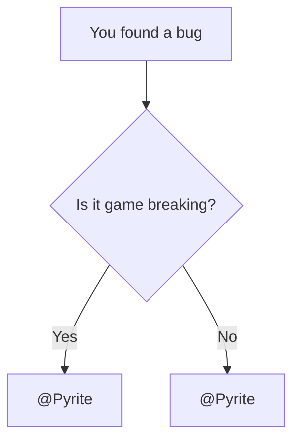

# Wiki Components Showcase

This page is a living sandbox for Wiki components.  
Add new component examples here whenever new functionality is introduced.

---

## Recipe Embed

Minimal usage:

```md
<Recipe id="tfg:chemical_bath/ad_astra_blue_flag" />
```

Live preview:

<Recipe id="tfg:chemical_bath/ad_astra_blue_flag" />

---

## Mermaid Diagram

Learn more about Mermaid at [https://mermaid.ai/open-source/intro/](https://mermaid.ai/open-source/intro/).



---

## Custom Components

### <GradientText> gradient-text </GradientText>

The `GradientText` component allows for customization with props.

```html
<GradientText> 
    Default Gradient
</GradientText>
```

<GradientText from="#00ff00" to="#0000ff"> Custom Colors (Green to Blue) </GradientText>

```html
<GradientText from="#00ff00" to="#0000ff"> 
    Custom Colors (Green to Blue)
</GradientText>

```
<GradientText dir="to bottom" from="red" to="yellow"> Custom Direction (Red to Yellow) </GradientText>

```html
<GradientText dir="to bottom" from="red" to="yellow"> 
    Custom Direction (Red to Yellow)
</GradientText>

```

<GradientText image="radial-gradient(circle, #fa18cf, #ff7967)"> Custom Type (Radial) </GradientText>

```html
<GradientText image="radial-gradient(circle, #fa18cf, #ff7967)"> 
    Custom Type (Radial)
</GradientText>
```

---

### <ModernHeader>modern-header </ModernHeader>

```html
<ModernHeader>
    modern-header
</ModernHeader>
```

---

### <ModernHeader fade> modern-header-fade </ModernHeader>

```html
<ModernHeader fade>
    modern-header-fade
</ModernHeader>
```

---