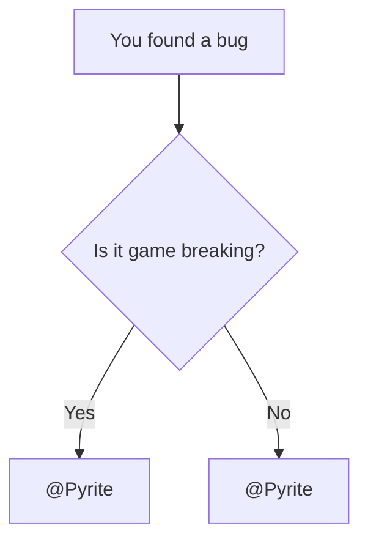

# Wiki Components Showcase

This page is a living sandbox for Wiki components.  
Add new component examples here whenever new functionality is introduced.

---

## Recipe Embed

Minimal usage:

```md
<Recipe id="tfg:chemical_bath/ad_astra_blue_flag" />
```

Live preview:

<Recipe id="tfg:chemical_bath/ad_astra_blue_flag" />

---

## Mermaid Diagram

Learn more about Mermaid at [https://mermaid.ai/open-source/intro/](https://mermaid.ai/open-source/intro/).



---

## Custom HTML Classes

Custom HTML classes can be found in [modern.css](../../../../.vitepress/theme/modern.css) and can be called in any document. Listed below are some notable options.

---

### <span class="gradient-text"> gradient-text </span>

The general `gradient-text` class allows for customization with CSS variables.

```html
<span class="gradient-text"> 
    Default Gradient
</span>
```

<span class="gradient-text" style="--gt-from: #00ff00; --gt-to: #0000ff;"> Custom Colors (Green to Blue) </span>

```html
<span class="gradient-text" style="--gt-from: #00ff00; --gt-to: #0000ff;"> 
    Custom Colors (Green to Blue)
</span>

```
<span class="gradient-text" style="--gt-dir: to bottom; --gt-from: red; --gt-to: yellow;"> Custom Direction (Red to Yellow) </span>

```html
<span class="gradient-text" style="--gt-dir: to bottom; --gt-from: red; --gt-to: yellow;"> 
    Custom Direction (Red to Yellow)
</span>

```

<span class="gradient-text" style="--gt-image: radial-gradient(circle, #fa18cf, #ff7967);"> Custom Type (Radial) </span>

```html
<span class="gradient-text" style="--gt-image: radial-gradient(circle, #fa18cf, #ff7967);"> 
    Custom Type (Radial)
</span>
```

---

### <div class="modern-header">modern-header </div>

```html
<div class="modern-header">
    modern-header
</div>
```

---

### <div class="modern-header-fade"> modern-header-fade </div>

```html
<div class="modern-header-fade">
    modern-header-fade
</div>
```

---