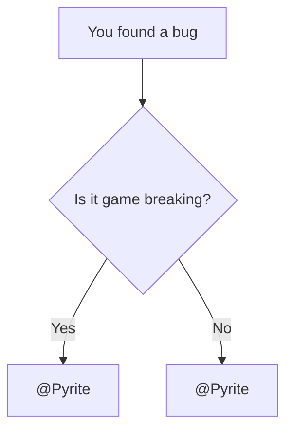

# Exibição de Componentes Wiki

Esta página é uma sandbox viva para componentes Wiki.  
Adicione novos exemplos de componentes aqui sempre que é introduzida nova funcionalidade.

## Incorporação de Receita

Uso mínimo:

```md
<Recipe id="tfg:chemical_bath/ad_astra_blue_flag" />
```

Pré-visualização ao vivo:

<Recipe id="tfg:chemical_bath/ad_astra_blue_flag" />

## Diagrama Mermaid

Saiba mais sobre Mermaid em [https://mermaid.ai/open-source/intro/](https://mermaid.ai/open-source/intro/).

