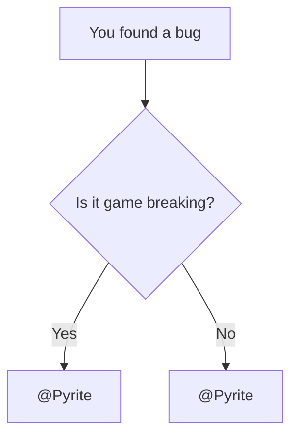

# Демонстрація компонентів Вікі

Ця сторінка — жива пісочниця для компонентів Вікі.  
Додавай сюди приклади нових компонентів щоразу, коли впроваджуєш новий функціонал.

---

## Вбудовування рецептів

Мінімальне використання:

```md
<Recipe id="tfg:chemical_bath/ad_astra_blue_flag" />
```

Попередній перегляд:

<Recipe id="tfg:chemical_bath/ad_astra_blue_flag" />

---

## Діаграма Mermaid

Дізнайся більше про Mermaid на [https://mermaid.ai/open-source/intro/](https://mermaid.ai/open-source/intro/).



---

## Користувацькі компоненти

### <GradientText> gradient-text </GradientText>

Компонент `GradientText` дозволяє налаштовувати зображення тексту за допомогою props.

```html
<GradientText> 
    Default Gradient
</GradientText>
```

<GradientText from="#00ff00" to="#0000ff"> Користувацькі кольори (зелений до синього) </GradientText>

```html
<GradientText from="#00ff00" to="#0000ff"> 
    Custom Colors (Green to Blue)
</GradientText>

```

<GradientText dir="to bottom" from="red" to="yellow"> Користувацькі кольори (червоний до жовтого) </GradientText>

```html
<GradientText dir="to bottom" from="red" to="yellow"> 
    Custom Direction (Red to Yellow)
</GradientText>

```

<GradientText image="radial-gradient(circle, #fa18cf, #ff7967)"> Користувацький тип (радіальний) </GradientText>

```html
<GradientText image="radial-gradient(circle, #fa18cf, #ff7967)"> 
    Custom Type (Radial)
</GradientText>
```

---

### <ModernHeader>modern-header </ModernHeader>

```html
<ModernHeader>
    modern-header
</ModernHeader>
```

---

### <ModernHeader fade> modern-header-fade </ModernHeader>

```html
<ModernHeader fade>
    modern-header-fade
</ModernHeader>
```

---