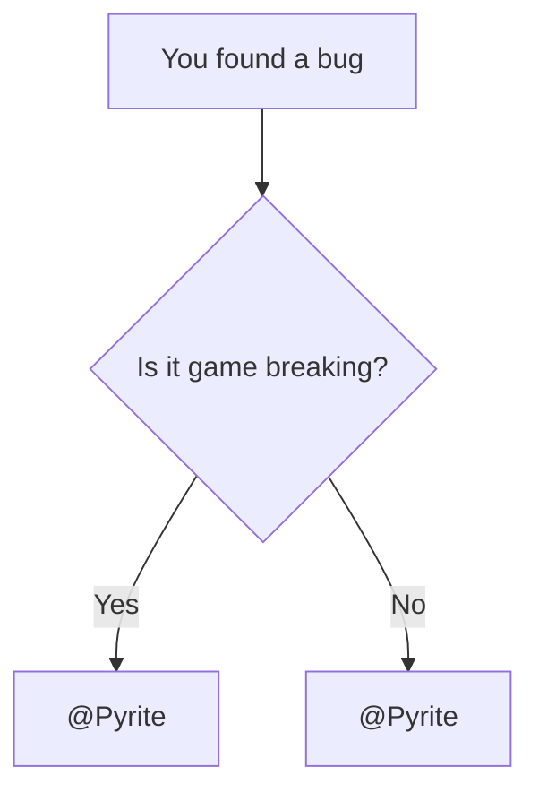

# Демонстрація компонентів Вікі

Ця сторінка — жива пісочниця для компонентів Вікі.  
Додавай сюди приклади нових компонентів щоразу, коли впроваджуєш новий функціонал.

## Вбудовування рецептів

Мінімальне використання:

```md
<Recipe id="tfg:chemical_bath/ad_astra_blue_flag" />
```

Попередній перегляд:

<Recipe id="tfg:chemical_bath/ad_astra_blue_flag" />

## Діаграма Mermaid

Дізнайся більше про Mermaid на [https://mermaid.ai/open-source/intro/](https://mermaid.ai/open-source/intro/).

