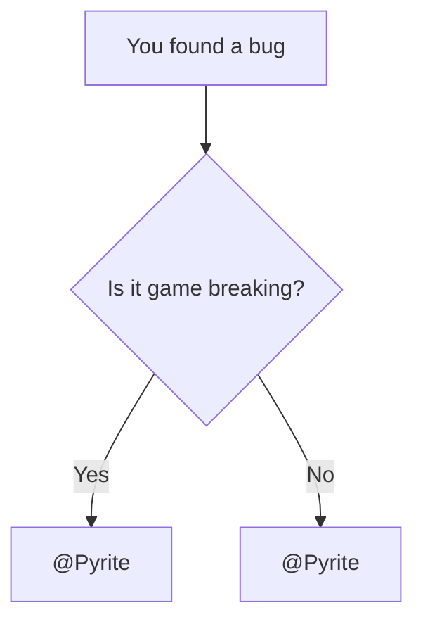

# Wiki组件展示

此页面是Wiki组件的动态沙盒。  
每当引入新功能时，请在此添加新的组件示例。

## 嵌入配方

最简用法：

```md
<Recipe id="tfg:chemical_bath/ad_astra_blue_flag" />
```

实时预览：

<Recipe id="tfg:chemical_bath/ad_astra_blue_flag" />

## Mermaid图表

访问[https://mermaid.ai/open-source/intro/](https://mermaid.ai/open-source/intro/)了解更多关于Mermaid的信息。

