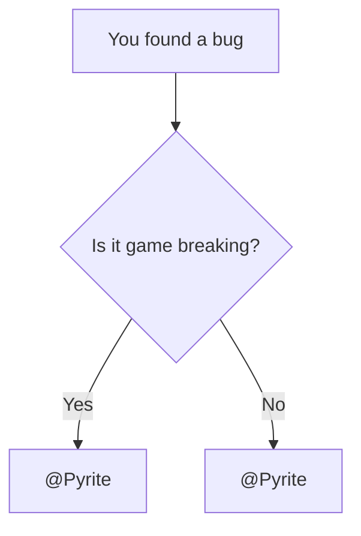

# Wiki组件展示

此页面是Wiki组件的动态沙盒。  
每当引入新功能时，请在此添加新的组件示例。

---

## 嵌入配方

最简用法：

```md
<Recipe id="tfg:chemical_bath/ad_astra_blue_flag" />
```

实时预览：

<Recipe id="tfg:chemical_bath/ad_astra_blue_flag" />

---

## Mermaid图表

访问[https://mermaid.ai/open-source/intro/](https://mermaid.ai/open-source/intro/)了解更多关于Mermaid的信息。


```mermaid
graph TD
  A[You found a bug] --> B{Is it game breaking?}
  B -->|Yes| C["@Pyrite"]
  B -->|No| D["@Pyrite"]
```

---

## 自定义组件

### <GradientText> 文字渐变 </GradientText>

`GradientText` 组件允许使用props进行自定义。

```html
<GradientText> 
    Default Gradient
</GradientText>
```

<GradientText from="#00ff00" to="#0000ff"> 自定义颜色 (从绿到蓝) </GradientText>

```html
<GradientText from="#00ff00" to="#0000ff"> 
    Custom Colors (Green to Blue)
</GradientText>

```

<GradientText dir="to bottom" from="red" to="yellow"> 自定义方向 (从红到黄) </GradientText>

```html
<GradientText dir="to bottom" from="red" to="yellow"> 
    Custom Direction (Red to Yellow)
</GradientText>

```

<GradientText image="radial-gradient(circle, #fa18cf, #ff7967)"> 自定义类型 (辐射) </GradientText>

```html
<GradientText image="radial-gradient(circle, #fa18cf, #ff7967)"> 
    Custom Type (Radial)
</GradientText>
```

---

### <ModernHeader> 现代页头 </ModernHeader>

```html
<ModernHeader>
    modern-header
</ModernHeader>
```

---

### <ModernHeader fade> 现代页头(渐变) </ModernHeader>

```html
<ModernHeader fade>
    modern-header-fade
</ModernHeader>
```

---